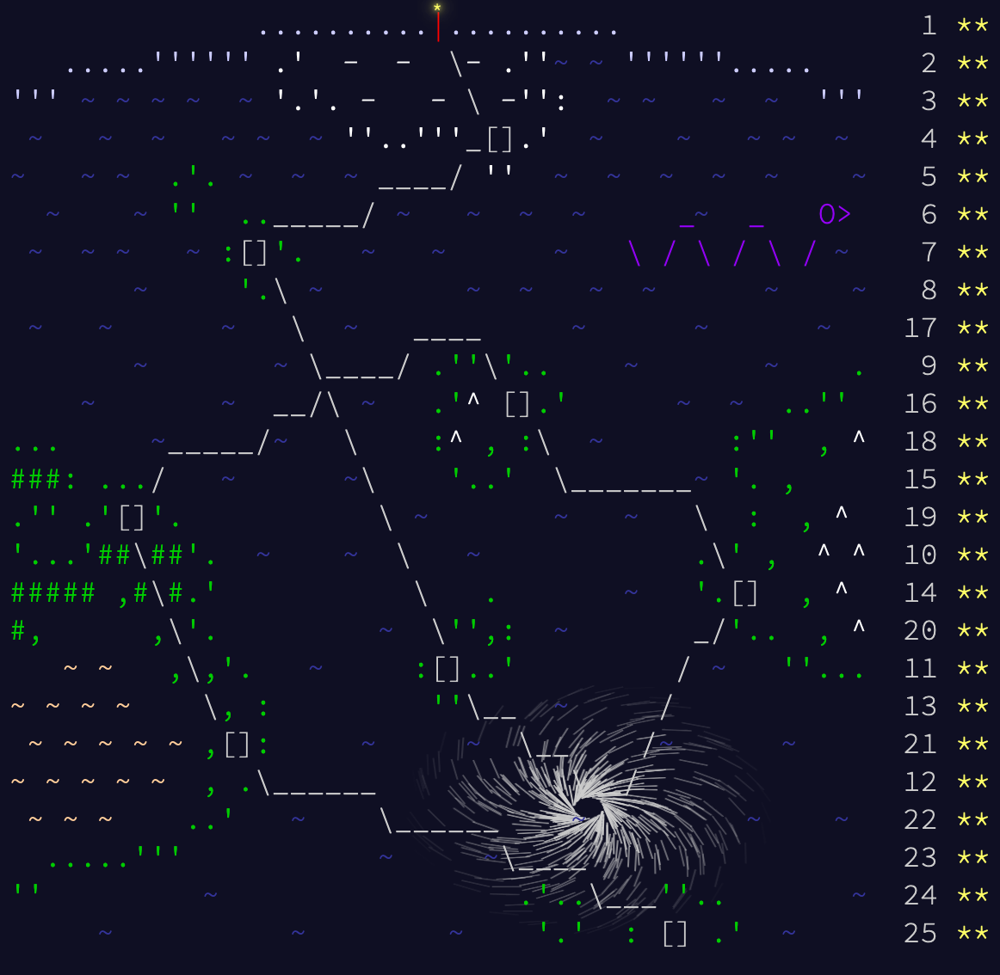

# Advent of Code 2020


[](https://GitHub.com/JnxF/advent-of-code-2020/stargazers/)
[](https://GitHub.com/JnxF/advent-of-code-2020/network/)
[](https://github.com/JnxF/advent-of-code-2020)
[](https://GitHub.com/JnxF/advent-of-code-2020/graphs/contributors/)
[](https://github.com/JnxF/advent-of-code-2020/blob/master/LICENSE)

## Completion status


## Installation

```bash
pip install -r
```

## Usage

```bash
$ python3 -i day01.py
>>> part1()
>>> part2()
>>> from aocd import submit
>>> submit(part2())
```

## License
[MIT](https://choosealicense.com/licenses/mit/)